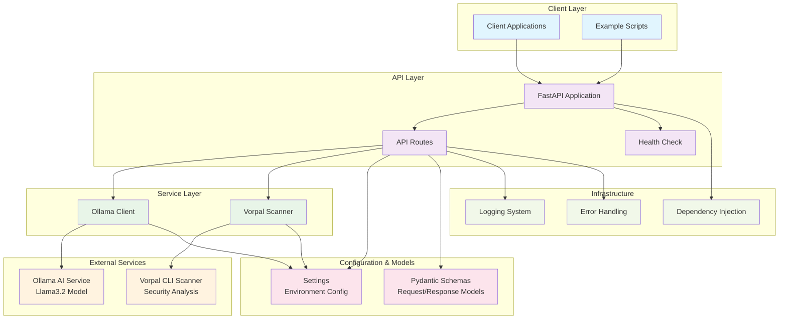

# Code Remediation API - Architecture Diagram

This architecture diagram shows the complete system structure, including all layers and components of the code remediation service.

## Architecture Layers

### Client Layer
- **Client Applications**: External applications consuming the remediation API
- **Example Scripts**: Provided testing and demonstration scripts

### API Layer
- **FastAPI Application**: Main web application framework
- **API Routes**: RESTful endpoints for remediation and health checking
- **Health Check**: Service availability and dependency status monitoring

### Service Layer
- **Ollama Client**: Abstraction layer for AI service communication
- **Vorpal Scanner**: Security scanning service wrapper

### External Services
- **Ollama AI Service**: AI model (Llama3.2) for code generation
- **Vorpal CLI Scanner**: External security vulnerability scanner

### Configuration & Models
- **Settings**: Environment-based configuration management with Pydantic
- **Schemas**: Request/response models and data validation

### Infrastructure
- **Logging System**: Comprehensive logging for monitoring and debugging
- **Error Handling**: Centralized error management and user-friendly responses
- **Dependency Injection**: FastAPI's dependency system for service management

## Design Principles

1. **Separation of Concerns**: Clear boundaries between API, business logic, and external services
2. **Dependency Injection**: Loose coupling through FastAPI's dependency system
3. **Configuration Management**: Environment-driven configuration for different deployment scenarios
4. **Error Handling**: Graceful error responses with appropriate HTTP status codes
5. **Security First**: Every code generation is validated through security scanning
6. **Observability**: Comprehensive logging for monitoring and troubleshooting

