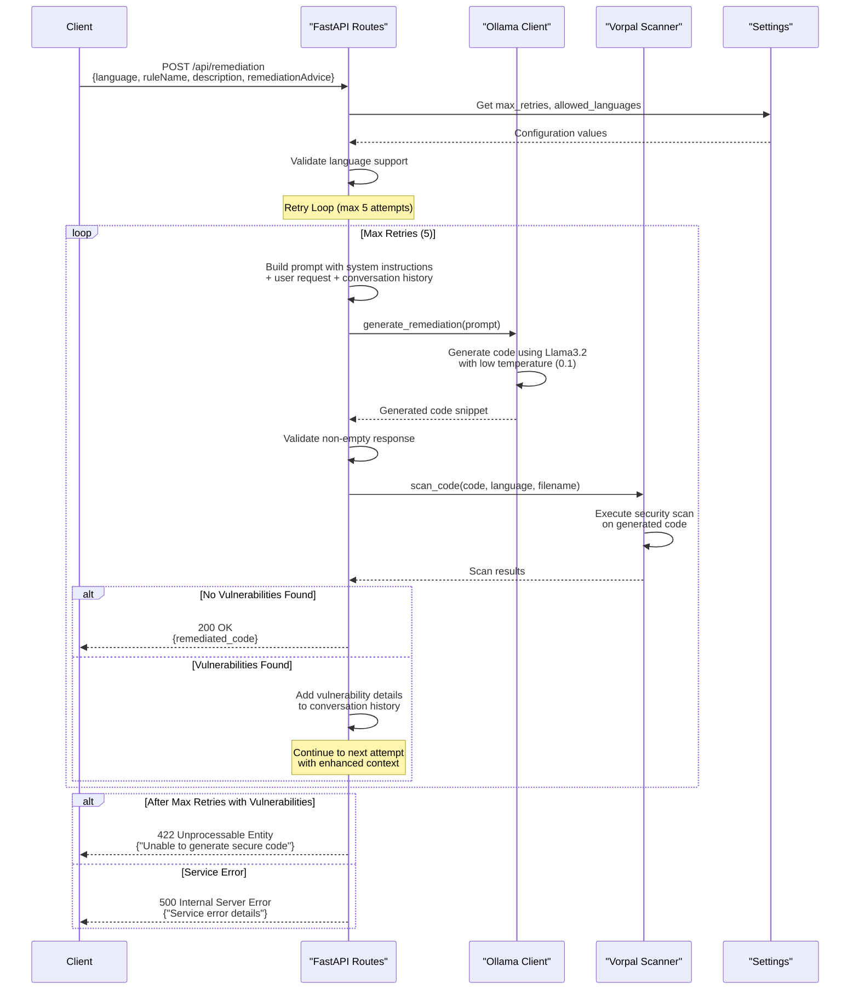

# Code Remediation API - Sequence Diagram

This sequence diagram shows the complete flow of the code remediation API, including the retry logic for security validation.

## Key Flow Points

1. **Request Validation**: The API first validates that the requested programming language is supported
2. **Iterative Improvement**: If vulnerabilities are found, the system uses conversation history to provide context for better code generation
3. **Security-First Approach**: Every generated code snippet is scanned before being returned to the client
4. **Graceful Degradation**: Clear error responses with details about what went wrong
5. **Configurable Retries**: Maximum retry attempts are configurable via environment settings

